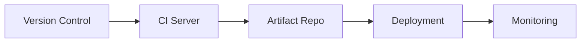

# DevOps: Stages, Tools, and Selection Guide


## DevOps Stages and Associated Tools

### 1. Plan 📝
**Tools:**
- **Jira** - Agile project management
- **Trello** - Kanban-style task tracking
- **Azure DevOps Boards** - End-to-end planning
- **GitHub Projects** - Integrated with code repositories

**Selection Criteria:**
- Team size and collaboration needs
- Integration with existing tools
- Agile methodology support

### 2. Code 💻
**Tools:**
- **Git** - Version control
- **GitHub/GitLab/Bitbucket** - Code hosting
- **VS Code/IntelliJ** - IDEs
- **SonarQube** - Code quality

**Selection Criteria:**
- Team familiarity
- Language/framework support
- Code review capabilities

### 3. Build 🏗️
**Tools:**
- **Jenkins** - Automation server
- **Gradle/Maven** - Java builds
- **NPM/Yarn** - JavaScript packages
- **Docker** - Containerization

**Selection Criteria:**
- Build complexity
- Language support
- Containerization needs

### 4. Test 🧪
**Tools:**
- **Selenium** - UI testing
- **JUnit/Pytest** - Unit testing
- **JMeter** - Load testing
- **Cypress** - E2E testing

**Selection Criteria:**
- Test type (unit/integration/E2E)
- Reporting needs
- CI pipeline integration

### 5. Deploy 🚀
**Tools:**
- **Ansible** - Configuration management
- **Terraform** - Infrastructure as Code
- **Kubernetes** - Container orchestration
- **AWS CodeDeploy** - Cloud deployments

**Selection Criteria:**
- Target environment (cloud/on-prem)
- Infrastructure complexity
- Rollback capabilities

### 6. Operate ⚙️
**Tools:**
- **Prometheus** - Monitoring
- **Grafana** - Visualization
- **ELK Stack** - Log management
- **New Relic** - APM

**Selection Criteria:**
- Monitoring granularity
- Alerting requirements
- Cost constraints

### 7. Monitor 🔍
**Tools:**
- **Datadog** - Full-stack observability
- **Splunk** - Log analysis
- **Nagios** - Infrastructure monitoring
- **PagerDuty** - Incident response

**Selection Criteria:**
- Team expertise
- Integration capabilities
- SLA requirements

## Tool Selection Framework

### 1. Assess Your Needs
- Team size and skillset
- Project complexity
- Compliance requirements
- Budget constraints

### 2. Evaluate Integration


### 3. Consider Key Factors
| Factor            | Questions to Ask                          |
|-------------------|------------------------------------------|
| Learning Curve    | How quickly can the team adopt it?       |
| Community Support | Is there active development/forums?      |
| Scalability       | Will it grow with your needs?            |
| Security          | Does it meet compliance requirements?    |

### 4. Prototype and Validate
- Run POCs with shortlisted tools
- Measure performance against KPIs
- Gather team feedback

## Recommended Toolchain by Project Size

**Small Teams/Projects:**
- GitHub Actions (CI/CD)
- Docker (Containers)
- Heroku (Deployment)
- Sentry (Monitoring)

**Enterprise Scale:**
- GitLab CI/CD
- Kubernetes
- Terraform
- Datadog

## Anti-Patterns to Avoid
- Tool sprawl (too many specialized tools)
- Vendor lock-in
- Over-engineering solutions
- Ignoring team feedback

## Resources
- [DevOps Roadmap](https://roadmap.sh/devops)
- [CNCF Landscape](https://landscape.cncf.io/)
- [ThoughtWorks Tech Radar](https://www.thoughtworks.com/radar)
```

